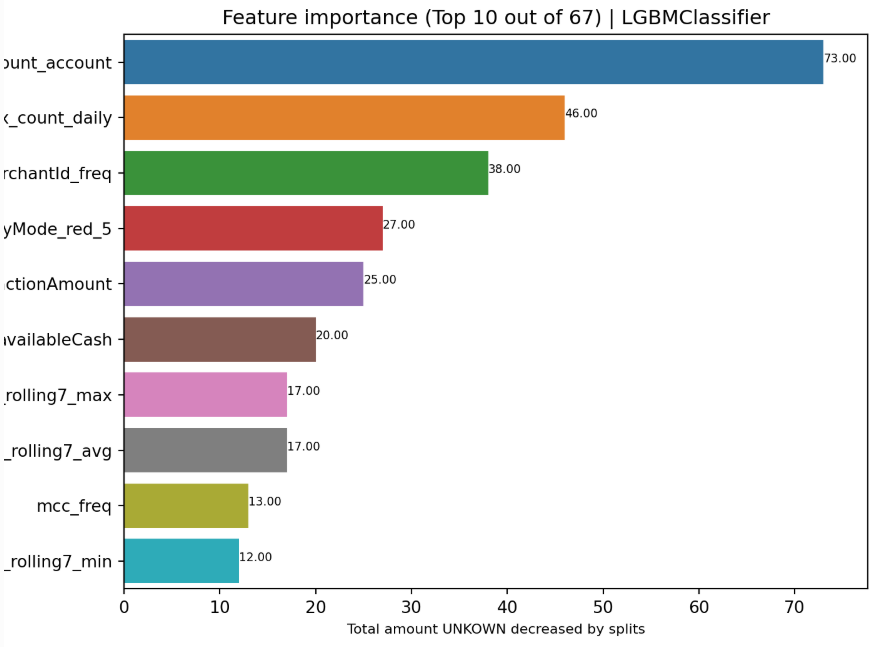
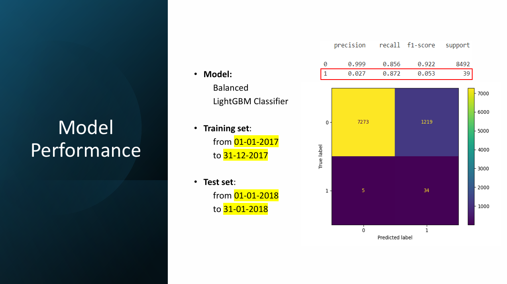
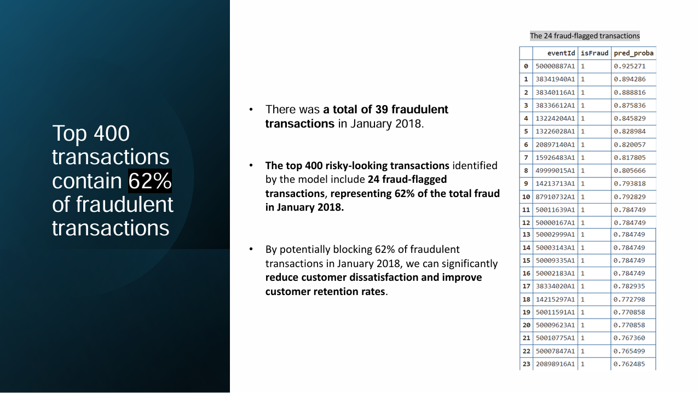

<h2 align="center">DESCRIPTION</h2>

- A model based on LightGBM Classifier to **detect credit fraud** has been developed.

  - `script.py`, contains all development code.
  - `credit_default_notebook.html`, full model development notebook in a visual html format so users can play with interactive plots (download to access).
  - `my_funcs_prep.py`, contains custom preprocessing and EDA functions used in development script.
    
<h2 align="center">SUMMARY</h2>

## 1. Business Problem
- **Customers of a banking company are experiencing fraudulent transactions, leading to dissatisfaction and potential financial losses**. To address this issue, the bank seeks to implement a machine learning solution that improves the monitoring of transactional activities on customer cards. The solution will assist a team of fraud analysts by prioritizing high-risk transactions for review.

## 2. Objective
The primary goal is to **develop a binary classification model that predicts the likelihood of a transaction being fraudulent**. The model will:
- Assign a fraud score to each transaction.
- Help the fraud analysts prioritize up to 400 transactions per month for review.
  
## 3. Initial Features
1. **transactionTime**: time the transaction was requested.
1. **eventId**: unique identifying string for this transaction.
1. **accountNumber**: account number which makes the transaction.
1. **merchantId**: unique identifying string for this merchant.
1. **mcc**: merchant category code of the merchant.
1. **merchantCountry**: unique identifying string for the merchant's country.
1. **merchantZip**: truncated zip code for the merchant's postal region.
1. **posEntryMode**: Point Of Sale entry mode.
1. **transactionAmount**: value of the transaction.
1. **availableCash**: amount available to spend prior to the transaction.

## 4. New Features (Feature Engineering)
1. **year**: year the transaction was requested.
1. **month**: month the transaction was requested.
1. **day**: day the transaction was requested.
1. **tnx_count_account**: total number of transactions associated with the account.
1. **tnx_count_daily**: number of transactions associated with the account on the same day.
1. **seconds_since_last_tnx**: time in seconds since the last recorded transaction for the account.
1. **tnx_rolling7_max**: maximum transaction amount within the last 7 days.
1. **tnx_rolling7_min**: minimum transaction amount within the last 7 days.
1. **tnx_rolling7_avg**: average transaction amount within the last 7 days.
1. **same_prev_tnx**: whether the current transaction amount matches the previous transaction amount.
1. **same_prev_merch_loc**: whether the current merchant location matches the location of the previous transaction.

## 5. Challenges
**Imbalanced data**: 
  - Fraudulent transactions are rare compared to legitimate ones, making the dataset highly imbalanced; only 875 fraudulent transactions vs 117,746 legitimate ones. 
  - Set *balanced class weights* for the models to give more importance to the minority class, penalizing misclassifications of minority fraudulent transactions more heavily.

**Time series nature** of the transactional data:
- Used *Timeseries split* to mantain temporal order in training data to avoid leakage of future information into the training set. 

## 6. Model Selection (tunned models)
|Model|fit time (s)|train f1|val f1|
|:-:|:-:|:-:|:-:|
|LogisticRegression|17.37|0.078|0.089|
|**LGBMClassifier**|**1.1**|**0.115**|**0.108**|
|RandomForestClassifier|4.68|0.12|0.11|

I **chose the LightGBMClassifier as the final model** for several reasons:
1. it trains faster,
2. the difference in F1 score between the RandomForestClassifier and LightGBMClassifier is marginal, and
3. the train and validation scores for LightGBM are more similar to each other, indicating lower variance and potentially better generalization.

```{python}
# Best LightGBMClassifier model.
lgbmc_rdsearch = LGBMClassifier(
    objective='binary',
    verbose=-1,
    random_state=0,
    class_weight='balanced',
    n_estimators=50,
    max_depth=3,
    learning_rate=0.1
)
```
## 7. Feature Importance


The **top 10 most important features** based on feature importance provided by LGBM are:
1. tnx_count_account.
1. tnx_count_daily.
1. merchantId_freq.
1. posEntryMode_red_5.
1. transactionAmount.
1. availableCash.
1. tnx_rolling7_max.
1. tnx_rolling7_avg.
1. mmc_freq.
1. tnx_rolling7_min.

## 8. Results

- The model has identified 34 fraud transactions out of 39 (**recall of 0.87**) in a total of 8531 transactions. However, the **precision is extremely low at 0.03**, leading to 1219 false positives.


