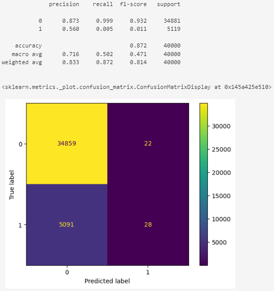
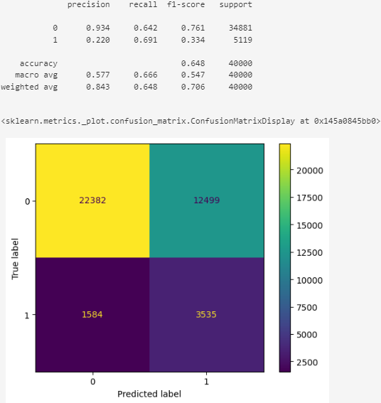

# DESCRIPTION
- A model based on **LightGBM Classifier to detect credit defaults** has been developed using data from a US financial institution. Balanced class weights were applied to mitigate class imbalance.
  - The first notebook, `1_Preprocessing.ipynb`, covers from the target definition to data preprocessing.
  - The second notebook, `2_Modeling.ipynb`, contains the modeling and evaluation phase.
  - Finally, the **trained model has been deployed in a web application** where real-time predictions can be made.
    
- Access the **first notebook**:: [[Link]](https://github.com/Haoqi9/Personal_Projects/blob/master/CreditRisk/03_Notebooks/1_Preprocessing.ipynb)
  - If for any reason GitHub cannot display the Jupyter notebook, try this alternative link: [[Alternative Link]](https://nbviewer.org/github/Haoqi9/Personal_Projects/blob/master/CreditRisk/03_Notebooks/1_Preprocessing.ipynb)
- Access the **second notebook**: [[Link]](https://github.com/Haoqi9/Personal_Projects/blob/master/CreditRisk/03_Notebooks/2_Modeling.ipynb)
  - Alternative: [[Alternative Link]](https://nbviewer.org/github/Haoqi9/Personal_Projects/blob/master/CreditRisk/03_Notebooks/2_Modeling.ipynb)    
- Access the **web application** (Credit Risk Analyzer): [[Link]](https://creditriskwebappst-lmmesu5xdk4m45fu9icbmf.streamlit.app/)

# RESULTS
## Sin balancear

## Balanced Class Weights

